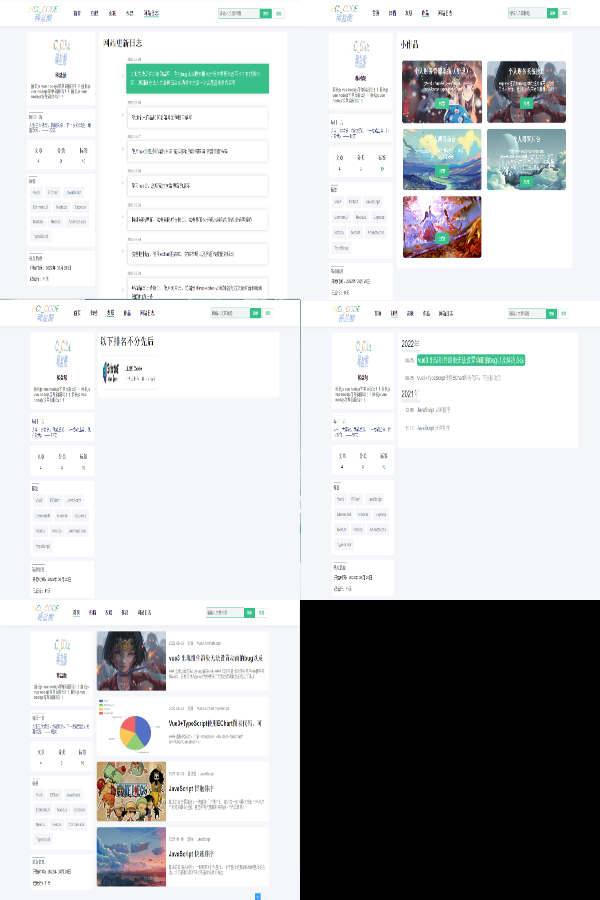
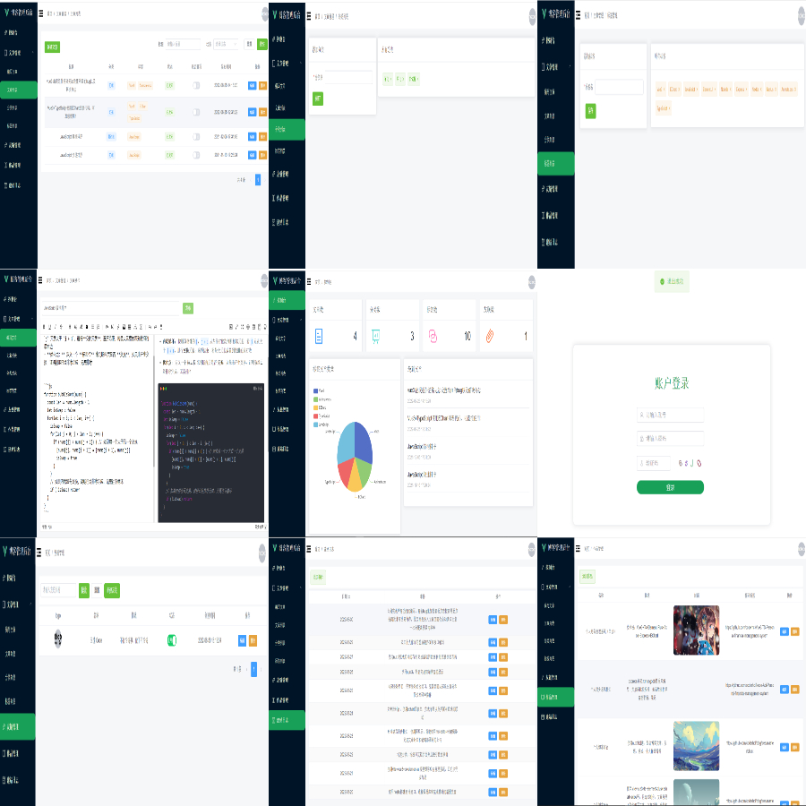

## 关于我

- 本科毕业，普普通通的一个前端小菜鸟，希望能在前端一路走下去，虽然疫情现在很难。
- 在校成绩：平均绩点：3.22/5   排 名：专业前 10%-15%
- 获得过奖励：【国家励志奖学金】【校级三等奖学金】【吴飞鹏奖学金】【互联网＋院级一等奖】【优秀共青团干部】
- 邮箱：2814884095@qq.com
- 属于一个地道的梅州客家人

## 关于作品

- 简单介绍本人写过的一些作品，这些作品都是自己设计自己编写前端和后端，以及接口实现，前后端都有涉及，对前后端分离等技术有一定了解

### 一、（毕设）基于 Web 的个人财务管理系统的设计与实现

#### 介绍

- 个人财务管理系统统（技术栈：Vue+Element+Echart+NodeJs,Express+MongoDB）
- 主要实现登录、邮箱注册验证、个人财务管理（收入，支出，投资，债务）、个人信息管理、财务类别管理、用户信息管理、公告管理等功能。
- 后端则主要使用 express 和 mongodb 数据库实现相对应功能的接口代码。

#### 地址：

- 前端： `https://github.com/coderhcl/Vue3-Ts_Personal-financial-management-system`
- 接口：`https://github.com/coderhcl/Node-Api-Personal-financial-management-system`

#### 截图（一部分）
- 具体详细信息可访问上面地址链接
 

### 二、个人博客前台、后台、接口

#### 介绍

- 前台使用 `nuxt3`，几乎纯手撸代码，后面可以使用`Tailwind.css`对其改造
- 后台使用 `vite`+`ts`+`vue3`+`element-plus`+`axios`+`echart` 等，
- 后端接口使用 `nestjs`+`prisma`+`mysql` 构建控制器，拦截器，权限验证等都有

#### 具体可以访问 ：`https://github.com/coderhcl/blog`

#### 截图（一部分）
- 具体详细信息可访问上面地址链接

##### 1.前台界面展示

##### 2.后台界面展示

#### 由于nuxt3目前还属于开发第一版，还有很多一些未知的bug，所有没有进行部署，使用vuepress作为自己的博客，以前自己写的博客因为电脑问题都没有了，有点可惜，所以才有这个版本。

#### 还有一些小demo如以前用vue2+element写的blog管理系统，比如新冠疫情大屏动态展示等就没有发出来了